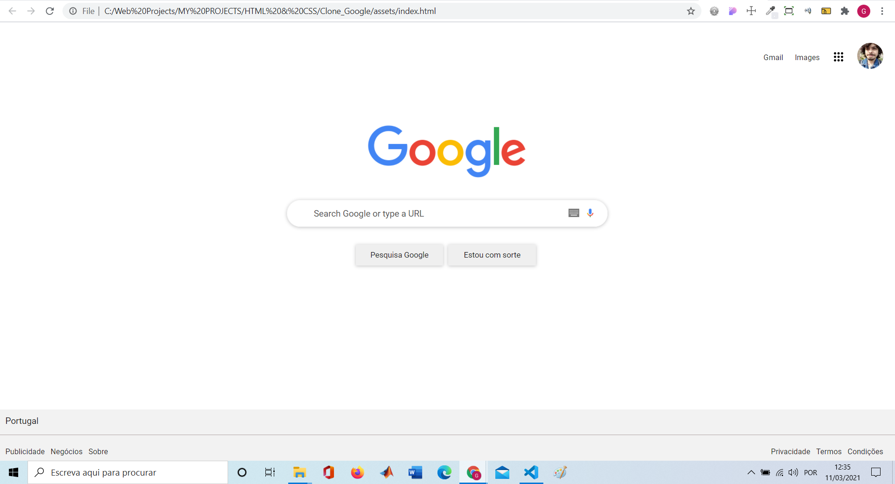

# Google home page clone
O meu primeiro projeto feito sem tutorias de um clone da Home Page do Google. Realizado em HTML e CSS, além do mais é responsivo :blush:

### :pushpin: Layout da aplicação

 

  

